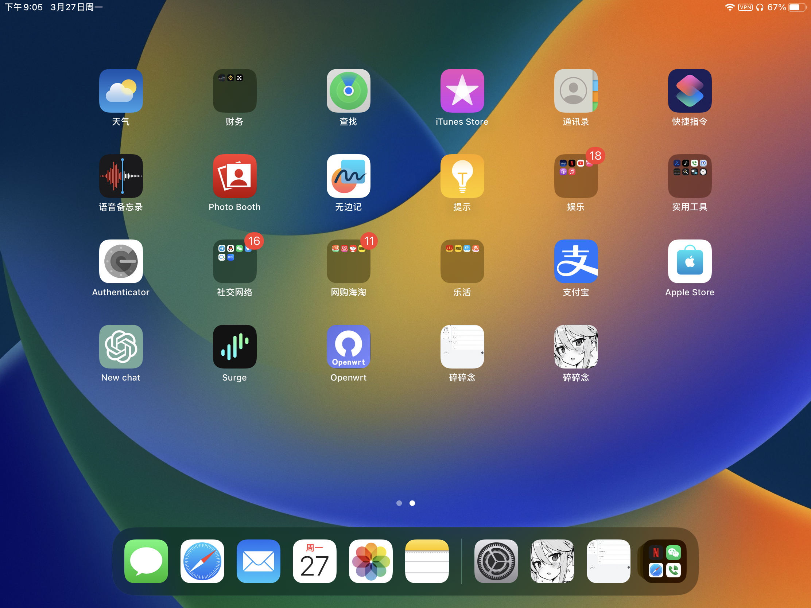
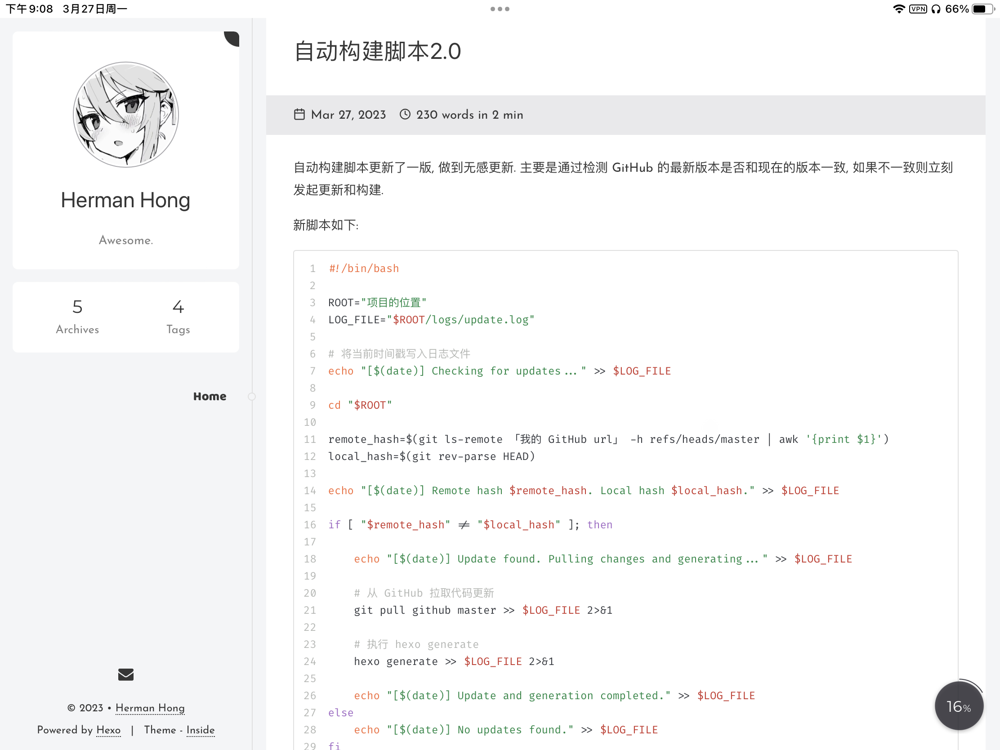

最近心态变化巨大, 总觉得作为程序员, 没有自己的作品, 实在是太 low 了. 然后我思考了一下, 可能一下子做个惊天地泣鬼神的作品比较困难, 但把博客持续运营起来应该比写大作品要轻松. 

不管怎么说, 持续的输出技术文章, 总结开发经验, 满足自己的输出欲其实是我一直以来都想做的事情, 碍于自己的时间管理实在做得太烂了, 总是工作不讨好, 自我提升又提升了个锤子.

这个博客网站就是希望自己能够重回大学的状态, 每天坚持输出, 灌水也好, 认真写文章也好, 希望保持自我总结, 持续输出成习惯.

可能文章每天都是灌水文, 但是这些事情还是慢慢做起来养成习惯, 总会到能坚持输出好文章的自己的. ~~麻痹自己, 感觉今天又完成了一件大事呢!~~

> #### 题外话
> 
> 现在 ChatGPT 真的是爆火, 这个玩意已经强到可以把一些低级码农给剃掉了, 以后开发可能只需要一两个水平比较高的程序员, 然后他们直接设计大框架, 其他的让 ai 写就完事了, 低端码农可以辞退了.
> 
> 我最近在积极的学习如何和 ai 打交道, 这个时代早点和 ai 混熟, 跑起来就比别人快个不止 10 倍. 希望自己能利用好这个工具, 不被取代吧.

## 我要支持 pwa

然后为什么会有这篇文章呢? 这里是记录一下这个博客支持 pwa 的一些过程.

> #### pwa 的简单介绍, 来源于 ChatGPT ~~意思是不保证正确性~~
> 
> PWA（渐进式Web应用程序）是一种在移动设备和桌面设备上提供原生应用程序类似体验的Web应用程序技术。PWA技术允许开发人员使用Web技术（HTML、CSS和JavaScript）创建可离线使用、可安装和可推送通知的应用程序，同时兼具Web应用程序的可访问性和可链接性。
> 
> 下面是PWA技术的一些主要特点：
> 
>1. 渐进式增强：PWA应用程序可以渐进式增强，即逐步提供更多的功能和体验，与用户设备和网络环境的兼容性相适应。这意味着，PWA应用程序可以在不支持某些新功能或技术的旧设备上正常运行，并在新设备上提供更丰富的功能。
>2. 离线支持：PWA应用程序可以使用Service Worker技术缓存Web资源，使得应用程序可以在离线情况下继续访问数据和功能，提高用户体验。
>3. 安装和启动快速：PWA应用程序可以直接从Web应用程序安装，而无需下载和安装像原生应用程序一样的应用商店，这使得用户可以更快速和方便地安装应用程序。
>4. 推送通知：PWA应用程序可以使用推送通知技术向用户发送消息，以便实时更新和提醒用户。
>5. 可发现性和链接性：PWA应用程序可以像普通Web应用程序一样被搜索引擎检索和链接，增加应用程序的曝光度和流量。
> 
> 总之，PWA技术的出现使得开发人员可以更好地利用Web技术创建类似原生应用程序的应用程序，并提供更好的用户体验，使得Web应用程序可以成为更有竞争力的应用程序解决方案。

为什么要支持 pwa ?首先, 我下面列的原因都不是因为这么做更好的原因, 纯粹是个人的喜好问题. 认同就 ok ,不认同就作罢, 没关系.

1. 我个人非常喜欢这项技术, 他不需要写客户端即可让用户有类似客户端的体验, 我自己也曾体验过很多 pwa 应用, 并且尝试将很多 web page 都使用 edge 或者 Safari 的发送到桌面做成 pwa 来使用. 奈何很多应用都没做成这个形式. 我希望自己的博客也能以 pwa 的形式上线, 不是为了实现什么功能, 单纯的就是喜欢这种形式. 如果我要持续优化这个博客, 那也说不定会在这上面做文章.
2. 第一次尝试, 希望简单折腾下, 了解一点信息. 我之前做的网页应用都是非常传统的 web page 的模式, 从来没有试过做个可以 web app 这种形式. 所以想在 hexo 中尝试这实现一下 pwa .
3. pwa 应用干净漂亮, 不会有多余的工具栏地址栏之类的出现.

所以为什么要写这篇文章? 因为这里面虽然是快速搭建一个博客系统, 但是里面还是碰到了比较 **难解决** 的 bug .记录一下, 方便以后迁移时忘记这些小坑.

> #### 难解决?
>
> 其实并不难, 主要是难在摸不着头脑, 我的解决方案也比较简单粗暴, 就是改 `node_modules` 的源码, 直接把 bug 改好了. 
>
> 因为是直接改 `node_modules` 的, 如果我的博客发生迁移了, 这些个问题必定会困扰以后的我很久, 所以特地记录一下.

---

## PWA 的实现效果

现在博客已经可以做到用 edge 安装到系统或者 Safari 发送到桌面作为一个应用使用了.

上图是 iPad OS 的显示效果, iPhone 也是一样的.~~要的就是一个干净漂亮.~~. 这里感谢 `hexo-theme-inside` 的作者, 主题非常简介漂亮, 好看!

---

## 支持 PWA 碰到的一些坑

首先选择 inside 的主题其中一个理由是他原生支持 pwa ,所以省点事直接用, 刚好主题也简洁大方.

把主题安装好配置好之后, 就开始我的适配 pwa 之旅了.

首先我参考的是这个人的文章:[Hexo添加PWA支持-阿里云开发者社区 (aliyun.com)](https://developer.aliyun.com/article/744051), 可以参考下, 然后实际上他就是把官方文档的做法抄了一遍. 或者可以直接看 hexo-pwa 的官方文档: [lavas-project/hexo-pwa: Hexo PWA plugin (github.com)](https://github.com/lavas-project/hexo-pwa).

> #### 额外的收获
>
> 获得了一个图片转换网站 [iLoveIMG | The fastest free web app for easy image modification.](https://www.iloveimg.com/). 这是文章里推荐使用的, 我用起来还可以, 我的头像就是这么生成的.

然后就会碰到第一个坑: 编译报错, 提示 `property data not defined` .

这个坑是因为 pwa 插件没有及时更新, hexo 大框架已经更新了一次了, 里面有个字段没有了. 然后插件的作者一直不更新到 npm 上导致会编译错误.

我懒得重新给他搞一个 npm 库了, issue 有个大佬已经 pr 了一次了, 就是没合并进去. 修改的内容具体在这个连接里面, 实际上就修改了一行代码: [Fix bug by simbafs · Pull Request #17 · lavas-project/hexo-pwa (github.com)](https://github.com/lavas-project/hexo-pwa/pull/17/commits/22dcfc76bc48181c070f39d8be83a5854e7bf5ec). 我直接改了 node_module 里的源码, 然后结束这个问题.

第二个问题, 是资源引用的问题, 我一开始不知道静态资源是要全部放在 source 里面才会被编译进去. 我傻愣愣的写在根目录下, 这个不算个大问题.

第三个问题是 Safari 浏览器不会读取网站的 icon 作为应用的图标问题. 这个还是通过改源码实现的. 上面的文章里面有写, 要改 layout 里面的模版文件实现. 在我这具体就是 `hexo-theme-inside/layout/index.njk` 里面, 把文章里的代码加进去.

~~所以这边文章的意义就是记录我的解决方案, 避免忘记啊, 我 tm 是直接改的源码哦.~~